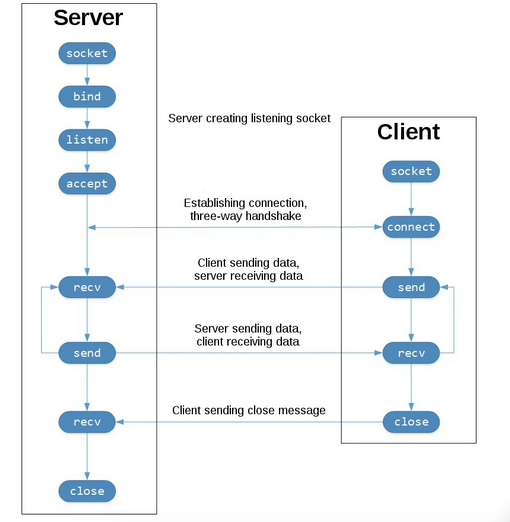

# Python Sockets Reporte
Aquí una breve explicación del funcionamiento del programa, cómo funciona internamente tanto el programa como la biblioteca “Sockets” al implementar protocolos de comunicación entre un cliente y un servidor.

En la imagen que presentamos a continuación podemos observar las funciones que desencadena cada método del objeto Socket, así como las representaciones del intercambio de información por medio de los métodos de envío y escucha.

Un servidor de escucha (listen) está en constante detección de los clientes que se quieran conectar a él. Cuando los clientes se conectan a él, el servidor llama a accept() para aceptar la conexión.

El cliente llama a la función connect() para establecer la conexión y comenzar con la verificación “three-way handshake.”

Ahora bien, en el medio tenemos todo el sistema de envío y recepción de mensajes de ambas partes, a través de las funciones send() y recv().

Al final en ambas partes se tiene la función close() que elimina el socket, ya sea el servidor o algún cliente.
